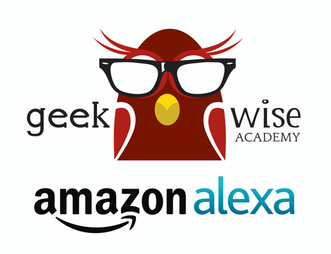

#[Geekwise Academy Alexa Skills Course](https://sammyboy45467.github.io/geekwise-alexa-course/src/index.html#/)

This is meant to as a guide for students who are interested in launching their own Skills using [AWS](https://aws.amazon.com/) and [Nodejs](https://nodejs.org/en/).

### What is Alexa?

When it comes down to it, Alexa is simply a headless browser with microphones and a speaker assembly. 

Because the device is essentially a browser, developers like you and me have the ability to write small 
scripts that can be ran from external services. The great thing about it, we can use our web programming skills that we use for browser apps!

#### Objectives of the Class

Your challenge, if you choose to accept...

* Expose students to the fundamentals of developing skills for Alexa.
* Give students the tools to build consumable Skills and publish them on the [Alexa Developer Portal](https://developer.amazon.com/edw/home.html)
* Expose students to developing web software for things other than web browsers

##Comments & Suggestions
If you have a comment or a suggestion feel free to submit an issue.

##Instructor Contact Information

[twitter](https://twitter.com/sammyboy45467)

[linkedIn](https://www.linkedin.com/in/jeremy-robles-62268792)

[jrobles@bitwiseindustries.com](mailto:jrobles@bitwiseindustries.com)
